# VibeLogic Studio — User Flow & Behavioral Specification

## Definitive Behavioral Source of Truth

> [!IMPORTANT]
> **Document Type:** Behavioral Specification & End-to-End User Journey Reference.
> **Audience:** Senior Product Designers, UX Architects, Software Architects, Product Managers, and AI Agents.
> **Authority:** When any uncertainty or ambiguity arises regarding application routing, permissions, empty states, error recovery, or user navigation, **this document is the final authority**.
> **Last Updated:** 2026-07-26

---

## 1. Document Goal & Engineering Philosophy

This document defines **HOW** users interact with VibeLogic Studio from their first touchpoint as an unauthenticated visitor to ongoing engagement as an enrolled student or platform administrator. 

- **Behavior Over Implementation:** It defines precisely what the system must do, where it redirects, how it validates input, and how it recovers from failure—without prescribing specific UI styling, CSS classes, or internal database schemas.
- **Exhaustive Decision Logic:** Every button click, route change, session check, empty state, and error condition is explicitly specified so an AI agent or engineer can implement complete, bulletproof routing and user flows without asking follow-up questions.
- **Deterministic Outcomes:** For every user action, there is exactly one success path and a defined set of failure/recovery paths.

---

## 2. User Types & Role Taxonomy

VibeLogic Studio defines four distinct behavioral roles, each with strict navigation boundaries:

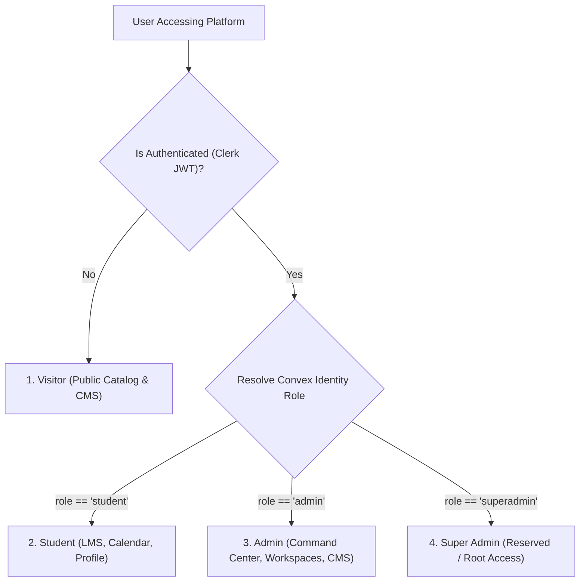

### Role Summary Table
| User Type | Access Scope | Session Behavior | Primary Goal |
| :--- | :--- | :--- | :--- |
| **Visitor** | `/`, `/courses`, `/course/[slug]`, `/sign-in`, `/sign-up`, `/faq` | Anonymous browser session. Rate-limited by IP/device. | Discover courses, evaluate social proof, and initiate checkout. |
| **Student** | All public routes + `/dashboard/*`, `/student/*`, `/profile` | Authenticated Clerk JWT (7-day rolling expiry). | Consume study materials, join live classes, watch recordings, and manage profile. |
| **Admin** | All public + student routes + `/admin/*` | Authenticated Clerk JWT with `admin` claim verified in Convex. | Operate Admin Command Center, publish courses, manage dedicated Batch Workspaces, upload media, and configure CMS. |
| **Super Admin** | Reserved for multi-tenant / system configuration | MFA-enforced JWT with root-level mutations. | Platform audit logs, payment gateway credentials, and system-wide overrides. |

---

## 3. Visitor Flow (Public Exploration & Discovery)

A Visitor explores the platform without authentication. The system ensures fast discovery while gracefully nudging toward enrollment.

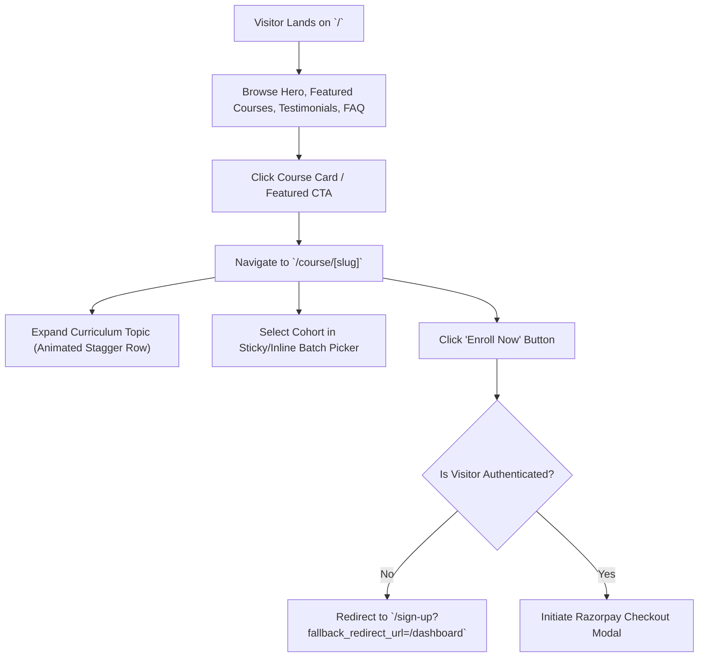

### Detailed Behavioral Requirements
1. **Landing Page (`/`):**
   - **Behavior:** Loads promotional banners, featured courses, and dynamic testimonials from Upstash Redis cache (`cache:cms:landing`).
   - **Loading State:** If cache is cold, renders a branded skeleton layout without layout shift.
   - **Error State:** If Convex CMS query fails, falls back to static default hero copy; never shows a broken error screen to a visitor.
2. **Catalog Browsing (`/courses`):**
   - **Behavior:** Allows filtering by category (`All`, `AI`, `Full-Stack`, `Design`) and keyword searching.
   - **URL Synchronization:** Changing a category filter or search query updates URL query parameters (`/courses?category=AI&search=sprint`) without a page reload.
   - **Back Navigation:** Clicking the browser Back button restores the exact scroll position and filter state.
3. **Course Detail Interaction (`/course/[slug]`):**
   - **Behavior:** Visitor can inspect course description, instructor credentials, itemized syllabus, student reviews, and live batch seat counts.
   - **Missing Slug Guard:** If `/course/[slug]` does not exist in Convex, system immediately renders a custom `404 Not Found` state with a "Browse All Courses" button.

---

## 4. Authentication Flow (Clerk Identity Resolution)

The authentication system governs entry into protected areas and ensures clean role-based routing.

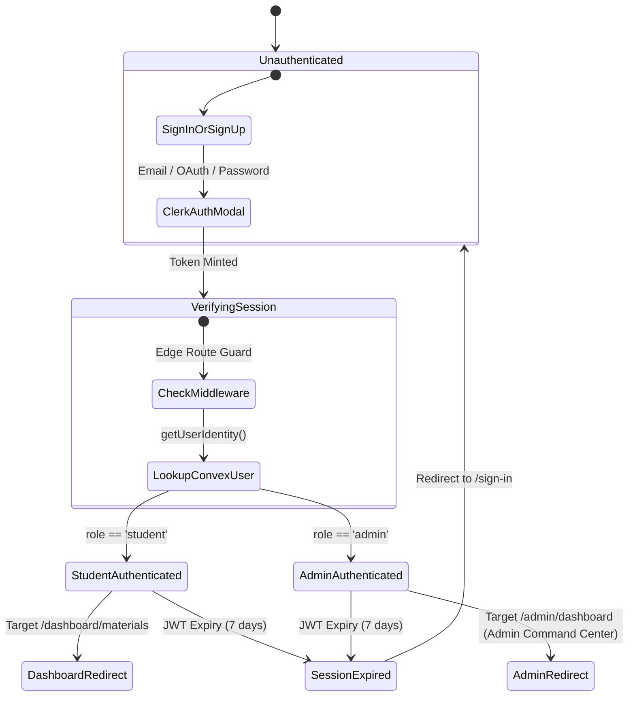

### Step-by-Step Authentication Rules
1. **Sign-Up & Login Entry (`/sign-in`, `/sign-up`):**
   - **Behavior:** Hosted within the Next.js App Router using Clerk components.
   - **Post-Login Routing:**
     - If the user was trying to access a protected URL before login, redirect to `fallback_redirect_url` or `redirect_url`.
     - If no target URL was specified, check `user.role`:
       - `role === 'admin'` → Redirect to `/admin/dashboard` (Admin Command Center & operational starting point).
       - `role === 'student'` → Redirect to `/dashboard/materials`.
2. **Session Expiry & Silent Refresh:**
   - **Behavior:** Clerk SDK automatically attempts a silent token refresh in the background.
   - **Expired Session:** If a user returns after 7 days of inactivity and the token cannot be refreshed, any attempt to navigate to `/dashboard/*` intercepts at the Edge Middleware and redirects to `/sign-in?redirect_url=/dashboard...`.
3. **Role & Privilege Guarding:**
   - **Student trying to access `/admin/*`:** Middleware or route layout detects non-admin claim and immediately redirects to `/dashboard/materials` with an info toast: *"Admin access required."*
   - **Admin accessing `/dashboard/*`:** Admin is allowed to browse student dashboard views for testing and previewing course materials.
4. **Logout Flow:**
   - **Behavior:** Clicking "Log Out" purges local session cookies, clears client-side Convex subscription caches, and redirects the user to `/`.

---

## 5. Marketplace Flow (Catalog Exploration & Search)

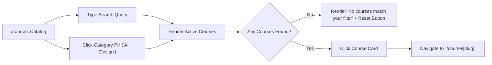

### Marketplace Edge Cases & Rules
- **No Active Courses in Category:** Display clear empty state: *"No courses available in [Category] yet. Check back soon or browse All Courses."*
- **Inactive / Draft Course:** If an admin marks `isActive: false`, the course is omitted from `/courses`. If a user bookmarks a direct URL `/course/[slug]` for a now-inactive course, display: *"This course is currently not accepting new enrollments."*

---

## 6. Course Details Flow (`/course/[slug]`)

The Course Details page is the primary conversion funnel. It presents complete information and enforces cohort capacity rules.

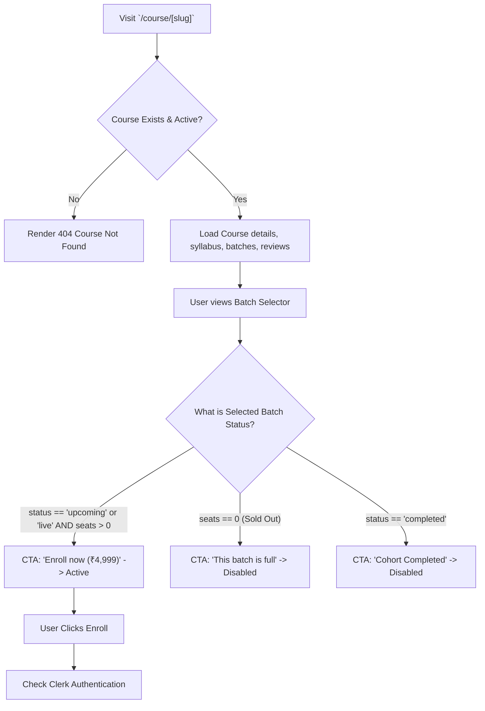

### Behavioral Specifications
- **Seat Scarcity Visualization:**
  - Shows real-time remaining seat count (`{remaining} of {capacity} seats open`).
  - As seats fill, visual progress bar fills dynamically.
- **Sold Out Cohorts:**
  - When `enrolledCount == capacity`, the cohort pill displays a red `"Full"` badge.
  - The enroll CTA button becomes disabled (`cursor-not-allowed`) with text `"This batch is full"`.
  - If another upcoming batch is available, the system automatically selects the next open batch by default.

---

## 7. Enrollment & Payment Processing Flow (The Core Conversion Engine)

This is the most critical behavioral sequence in the application. It ensures zero duplicate payments and atomic cohort assignment.

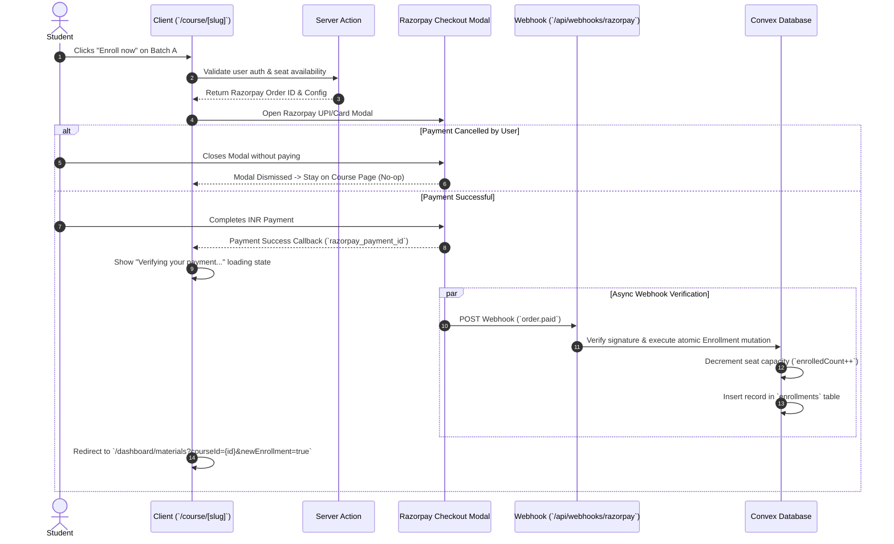

### Step-by-Step Behavioral Requirements
1. **Enrollment Initiation:**
   - User clicks `"Enroll now"`.
   - System checks if user is logged in. If anonymous, redirect to `/sign-up?fallback_redirect_url=/course/[slug]`.
   - If user already holds an active enrollment for this course, display a modal: *"You are already enrolled in this course!"* with a button `"Go to Classroom"`.
2. **Checkout Modal Execution:**
   - Server mints an INR Razorpay order and opens the overlay modal.
   - If the user closes the modal without paying, the UI returns to normal interactive state. No draft enrollment is created.
3. **Payment Verification & Confirmation:**
   - Upon successful payment, the UI displays a full-screen or toast overlay: *"Payment confirmed! Preparing your classroom..."*
   - Once Convex confirms the `enrollments` record via WebSocket or polling, the user is redirected to `/dashboard/materials?courseId={id}`.
4. **WhatsApp Community Welcome Popup:**
   - If `newEnrollment=true` is present in the URL on first arrival at the dashboard, present an immediate modal popup:
     - **Title:** *"Welcome to the Cohort!"*
     - **Body:** *"Join your official batch WhatsApp group to get daily updates, class links, and connect with peers."*
     - **Buttons:** `"Join WhatsApp Group"` (opens link in new tab) and `"I'll join later"` (closes modal).
   - Once dismissed, store a flag in localStorage so the popup does not repeatedly appear on page refreshes.

---

## 8. Batch Assignment Flow

```mermaid
flowchart TD
    START["Enrollment Confirmed"] --> CHECK_BATCH{"Was Batch explicitly selected?"}
    CHECK_BATCH -->|Yes| CHECK_SEAT{"enrolledCount < capacity?"}
    CHECK_BATCH -->|No (Auto-Assign)| FIND_NEXT["Query Active Batches ordered by startDate"]
    
    FIND_NEXT --> CHECK_SEAT
    
    CHECK_SEAT -->|Yes| ASSIGN_BATCH["Insert Enrollment & Increment enrolledCount"]
    CHECK_SEAT -->|No (Batch Sold Out)| OVERFLOW["Assign to Next Upcoming Batch OR create Overflow Cohort"]
    
    OVERFLOW --> NOTIFY_USER["Send Email: 'Cohort Assigned - Schedule Updated'"]
    ASSIGN_BATCH --> GRANT_LMS["Grant immediate access to /dashboard/materials"]
```

---

## 9. Student Dashboard Flow (`/dashboard/*`)

The Student Dashboard is the operational center for learners. It unifies materials, live classes, recordings, and announcements under a single persistent sidebar.

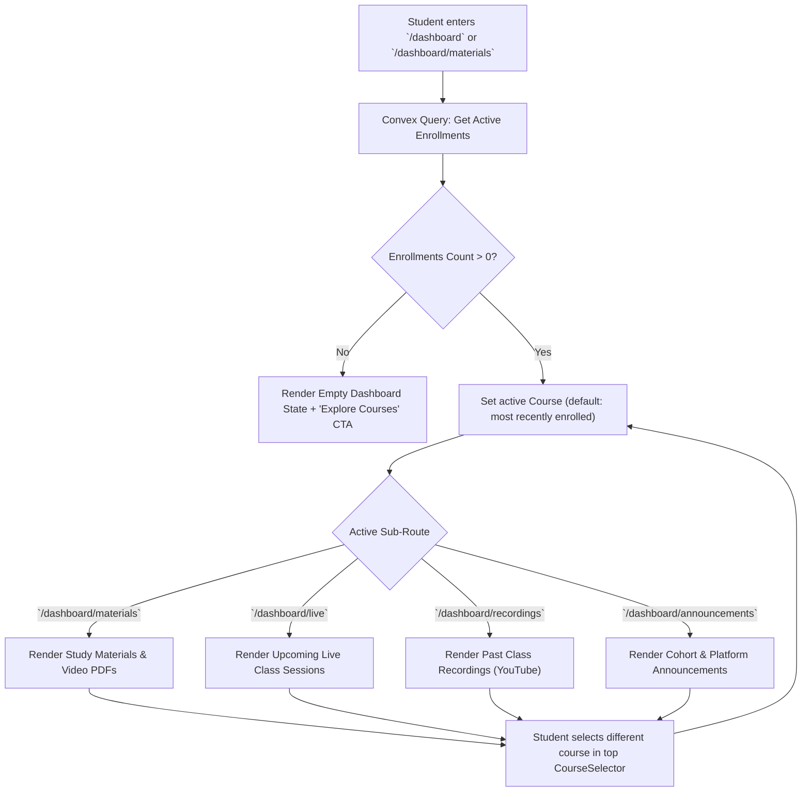

### Dashboard Navigation & Multi-Course Rules
- **Course Selector:** When a student is enrolled in multiple courses, a persistent dropdown (`CourseSelector`) in the top navigation bar allows switching between courses.
- **URL Parameter Preservation:** Selecting a new course updates the URL to `?courseId={id}`. All sidebar tabs (`Materials`, `Live`, `Recordings`, `Announcements`) respect the currently active `courseId`.
- **Empty Enrollment State:** If an authenticated user without enrollments visits `/dashboard/*`, display an engaging empty state with an illustration, copy *"You haven't enrolled in a course yet"*, and a primary button *"Explore Marketplace"*.

---

## 10. Live Class Flow (`/dashboard/live` & `/dashboard/calendar`)

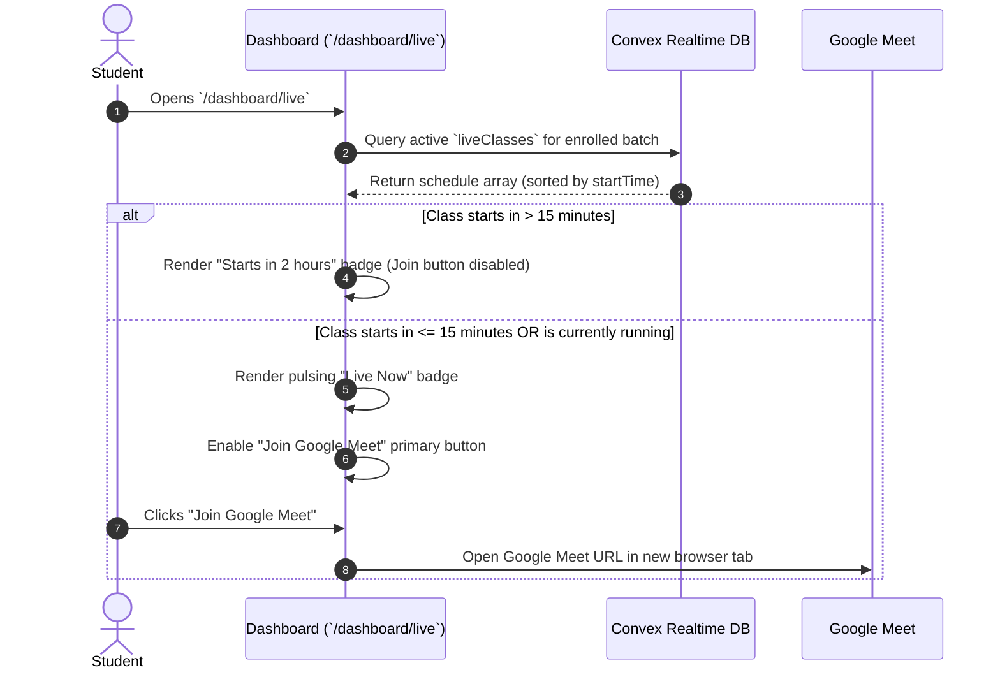

---

## 11. Study Material Flow (`/dashboard/materials`)

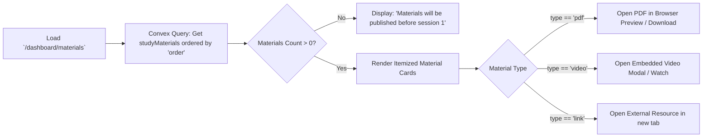

---

## 12. Recording Flow (`/dashboard/recordings`)

1. **Behavior:** Lists all completed class sessions where the instructor has added a `recordingUrl` (YouTube Unlisted).
2. **Interactive Player:** Clicking a recording card opens an inline or modal video player.
3. **Empty State:** If no recordings are published yet, display: *"No class recordings published yet. Recordings appear within 24 hours of class completion."*

---

## 13. Calendar Flow (`/dashboard/calendar`)

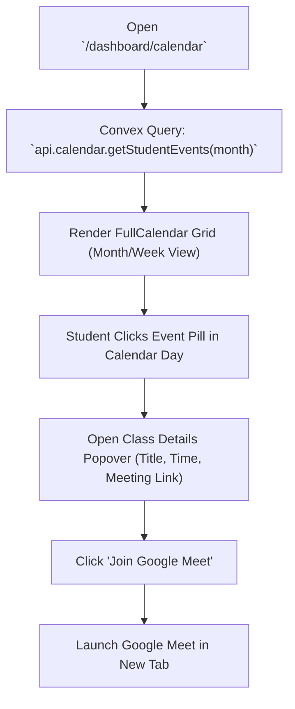

---

## 14. Announcement Flow (`/dashboard/announcements`)

- **Admin Publishing:** Admin creates an announcement scoped to a specific `batchId` (via `/admin/batches/[batchId]/announcements` or global Quick Create) or platform-wide (`batchId: null` via `/admin/announcements`). Supports Draft, Scheduled, and Published states with attachments, email toggles, WhatsApp toggles, and push notifications.
- **Realtime Delivery:** The announcement appears immediately on all connected student dashboards via Convex WebSocket push.
- **Email Broadcast:** Concurrently, Resend emails the announcement text to all enrolled students in the cohort.

---

## 15. Review & Testimonial Submission Flow

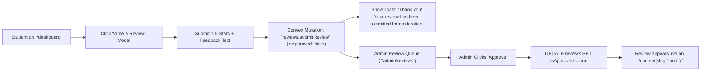

---

## 16. WhatsApp Community Integration Flow

- **Payment Success Popup:** Triggered immediately after checkout when `?newEnrollment=true` is present.
- **Persistent Access:** A student can always find their official WhatsApp cohort link under `/dashboard/announcements` or in the top banner of `/dashboard/materials`.
- **Batch-Specific Links:** Each cohort (`batchId`) stores its own dedicated WhatsApp group invite link, ensuring students only join their peer group.

---

## 17. Student Profile & Settings Flow (`/dashboard/settings`)

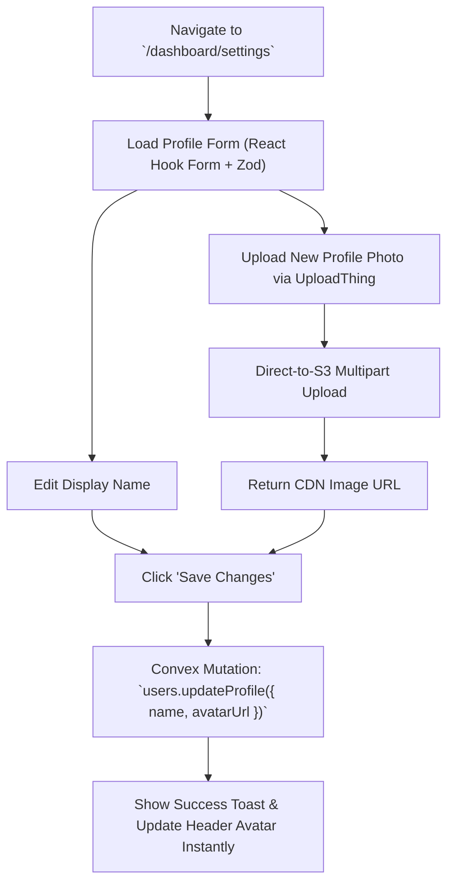

---

## 18. Admin Platform Management Flow (`/admin/*`)

The Admin suite provides complete CRUD control over the platform catalog, cohorts, students, and CMS. The Admin Dashboard (`/admin/dashboard`) is the operational home for administrators—acting as an Admin Command Center and the starting point for all admin workflows rather than only an analytics page.

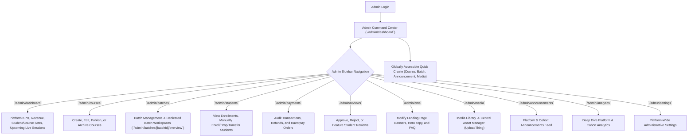

### Admin Dashboard & Operational Hub (`/admin/dashboard`)
1. **Command Center Behavior:**
   - **Operational Hub Loop:** `Admin Login ↓ Dashboard ↓ Choose Module ↓ Perform Action ↓ Return Dashboard`.
   - After login, administrators land on `/admin/dashboard`, which serves as the starting point for all admin workflows.
2. **Dashboard Contents:**
   - **Platform KPIs & Financials:** Total Revenue, Active Students, Course Statistics, Student Statistics, Completion Rate, and Revenue/Enrollments trends.
   - **Operational Insights:** Recent Activity feed, Course Popularity progress meters, and Upcoming Live Sessions schedule.
   - **Quick Actions:** Dedicated action triggers for `Create Course`, `Create Batch`, `Announcements`, and `Media Upload`.
3. **Globally Accessible Quick Create:**
   - A persistent `Quick Create` trigger is globally accessible across every page in the `/admin/*` suite.
   - Allows instant initiation of: `Create Course`, `Create Batch`, `Announcement`, and `Upload Media` without losing context.

### Batch Management & Dedicated Batch Workspace (`/admin/batches`)
The Batch Management page (`/admin/batches`) remains a collection of batch cards. However, clicking a batch card now navigates directly to a dedicated **Batch Workspace** at `/admin/batches/[batchId]/overview` (NOT a modal and NOT an expandable card). The Batch Workspace is the primary operational workspace for administrators managing a specific cohort.

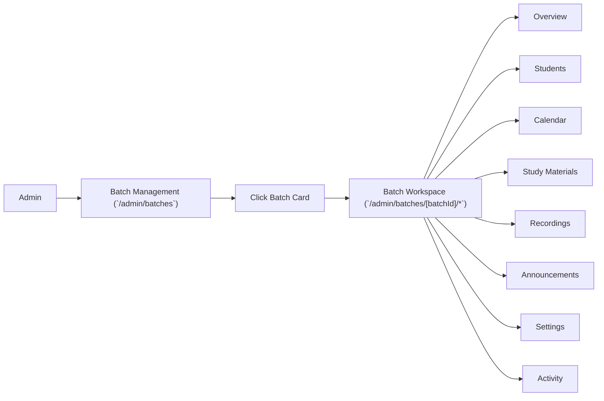

### Persistent Batch Header & Navigation Tabs
Every page within a Batch Workspace shares a **persistent header** and **shared tabbed navigation**. Only the content below the tabs changes; the header remains constant across all tab views.
- **Persistent Batch Header Contents:** Displays `Batch Name`, `Status` (`upcoming` | `live` | `completed`), `Seats` filled/remaining, `Revenue` generated, parent `Course` badge, batch `Date` range, `WhatsApp Group` link, `Google Meet` link, `Publish Changes` button, and `Edit Batch` trigger.
- **Persistent Workspace Tabs & Behaviors:**
  1. **Overview (`/admin/batches/[batchId]/overview`):** The operational command center where administrators begin batch management. Contains cohort KPIs, Next Live Session card, Student Progress bars, Attendance Overview, Recent Activity, Quick Actions, Batch Overview details, and Quick Resources (GitHub Repo, Notion Page, Discord, Drive Folder).
  2. **Students (`/admin/batches/[batchId]/students`):** Dedicated page for cohort learner management. Supports Search Students, Filter Students, View Student Profile (Student Detail Drawer), Remove Student, Transfer Student, Export CSV, Invite Student, and Bulk Actions.
  3. **Calendar (`/admin/batches/[batchId]/calendar`):** Dedicated scheduling page. Supports Create Class, Edit Class, Delete Class, Recurring Classes, Google Meet Links, Drag and Drop rescheduling, and Month / Week / Day / Agenda views. Clicking any class event opens an interactive edit panel.
  4. **Study Materials (`/admin/batches/[batchId]/materials`):** Supports Upload Notes, Organize Modules, Folders, Preview Files, Replace Files, Delete Files, Visibility Toggle, Search, and Filter.
  5. **Recordings (`/admin/batches/[batchId]/recordings`):** Supports Upload Recording, YouTube Link insertion, Preview, Replace, Delete, Publish toggle, and per-video Analytics.
  6. **Announcements (`/admin/batches/[batchId]/announcements`):** Supports Create Announcement with Draft, Scheduled, and Published states, Attachments, Email Toggle, WhatsApp Toggle, and Push Notifications.
  7. **Settings (`/admin/batches/[batchId]/settings`):** Configures Batch Details, Capacity limits, Enrollment toggles, Communication links, Permissions, and a Danger Zone for cohort archival/deletion.
  8. **Activity (`/admin/batches/[batchId]/activity`):** Audit Timeline tracking Batch Changes, Student Joined, Student Removed, Announcement Published, Recording Uploaded, Attendance updates, and Settings Updated.

### Admin Operational Behavior
1. **Course Publishing:**
   - Setting a course to `isActive: true` immediately broadcasts it to the `/courses` marketplace.
   - Archiving a course (`isActive: false`) hides it from the catalog but preserves LMS access for currently enrolled students.
2. **Manual Student Enrollment:**
   - Admins can manually grant course access to any user email via `/admin/students` or from the Batch Workspace Students tab (`/admin/batches/[batchId]/students`), bypassing Razorpay checkout.
3. **Class Scheduling & Recording Entry:**
   - Admins create `liveClasses` records with start/end UTC timestamps and Google Meet URLs directly in `/admin/batches/[batchId]/calendar`.
   - After class, admins paste the YouTube Unlisted URL into the session record in `/admin/batches/[batchId]/recordings`, immediately publishing it to `/dashboard/recordings`.

---

## 19. Landing Page CMS Flow (`/admin/cms`)

1. **Admin Action:** Admin edits hero headline, subheadline, or announcement banner in `/admin/cms` and clicks "Save".
2. **Database Mutation:** `api.admin.cms.updateSection` updates the `landingPage` JSON document in Convex.
3. **Cache Invalidation:** Triggers Redis deletion (`redis.del('cache:cms:landing')`).
4. **Instant Site Update:** The very next visitor to `/` sees the updated content without requiring a frontend Vercel redeployment.

---

## 20. Media Library Flow (`/admin/media`)

- **Upload:** Central library supporting drag-and-drop UploadThing uploads for images (`.webp`, `.jpg`), videos, and course PDFs.
- **Reuse:** Downloaded URLs can be attached to any course syllabus, batch material, or CMS banner.

---

## 21. Payment Verification & Edge Case Behavioral Reference

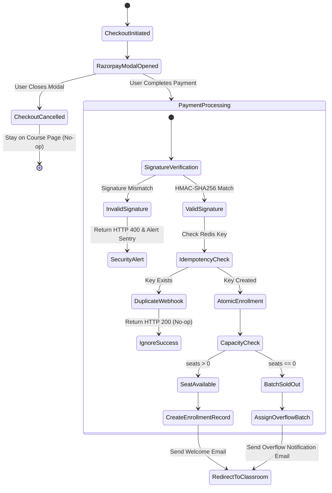

---

## 22. Upstash Redis Caching in the User Journey

Upstash Redis participates silently as a high-speed cache layer to accelerate page loads and enforce rate limits.

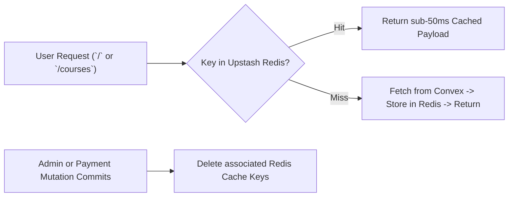

> [!CAUTION]
> **Architectural Rule:** Upstash Redis never replaces Convex. If Redis fails or times out (`>800ms`), the system automatically fails-open and reads directly from Convex, ensuring **zero user-facing downtime**.

---

## 23. Comprehensive Permissions & Authorization Matrix

| Route / Action | Visitor | Student (Unenrolled) | Student (Enrolled) | Admin | Super Admin |
| :--- | :---: | :---: | :---: | :---: | :---: |
| View `/`, `/courses`, `/faq` | ✅ Yes | ✅ Yes | ✅ Yes | ✅ Yes | ✅ Yes |
| View Course Details `/course/[slug]` | ✅ Yes | ✅ Yes | ✅ Yes | ✅ Yes | ✅ Yes |
| Initiate Razorpay Checkout | ✅ Yes* | ✅ Yes | ❌ No** | ✅ Yes | ✅ Yes |
| Access `/dashboard` (Empty State) | ❌ No | ✅ Yes | ✅ Yes | ✅ Yes | ✅ Yes |
| Access `/dashboard/materials` (Course X) | ❌ No | ❌ No | ✅ Yes (Course X) | ✅ Yes (All) | ✅ Yes (All) |
| Join Google Meet (`/dashboard/live`) | ❌ No | ❌ No | ✅ Yes (Course X) | ✅ Yes (All) | ✅ Yes (All) |
| Submit Course Review | ❌ No | ❌ No | ✅ Yes (Course X) | ✅ Yes | ✅ Yes |
| Access `/admin/*` Suite | ❌ No | ❌ No | ❌ No | ✅ Yes | ✅ Yes |
| Mutate `courses`, `batches`, `cms` | ❌ No | ❌ No | ❌ No | ✅ Yes | ✅ Yes |

*\*Visitors initiating checkout are first redirected to Sign-Up.*
*\*\*Students already enrolled in Course X receive a modal directing them to their Classroom.*

---

## 24. Exhaustive Empty States Inventory

Every view in VibeLogic Studio must present an intentional, beautifully designed empty state rather than a blank screen or technical zero-count message.

| Location | Trigger Condition | UI Title & Copy | Action CTA |
| :--- | :--- | :--- | :--- |
| `/courses` | Search query or filter matches 0 courses | *"No courses found matching your criteria."* | `"Clear Filters"` (Resets URL params) |
| `/dashboard` | Authenticated student has 0 active enrollments | *"Your classroom is empty."* / *"You haven't enrolled in any cohorts yet."* | `"Explore Course Catalog"` → `/courses` |
| `/dashboard/materials` | Admin hasn't published study materials for cohort yet | *"Study materials are on the way."* / *"Documents and PDFs will be published here prior to Session 1."* | `"View Live Schedule"` → `/dashboard/live` |
| `/dashboard/recordings` | 0 recordings published for enrolled cohort | *"No class recordings available yet."* / *"Video recordings appear within 24 hours of each live class."* | `"Check Next Live Class"` → `/dashboard/live` |
| `/dashboard/calendar` | 0 live classes scheduled for selected month | *"No classes scheduled for this month."* | `"Switch to Current Month"` |
| `/dashboard/announcements` | 0 batch or platform announcements | *"All caught up!"* / *"No announcements have been posted for your batch."* | None (Informational badge) |
| `/course/[slug]` (Reviews) | 0 approved reviews for course | *"Be the first to review!"* (Shown only to enrolled students; hidden from visitors) | `"Write a Review"` |

---

## 25. System Error States & User Recovery Paths

| Error State | System Cause | User-Facing Message | User Recovery Action |
| :--- | :--- | :--- | :--- |
| **404 Course Not Found** | `/course/[slug]` slug does not exist in Convex | *"We couldn't find the course you're looking for."* | `"Browse All Courses"` → `/courses` |
| **401 Unauthorized** | Session JWT expired or missing on protected route | *"Please log in to continue."* | Redirects to `/sign-in?redirect_url={path}` |
| **403 Forbidden** | Student attempts to navigate to `/admin/*` | *"You do not have administrative access."* | `"Go to Student Dashboard"` → `/dashboard/materials` |
| **Payment Failed** | Razorpay UPI/Card transaction declined by bank | *"Payment declined by your financial institution."* | `"Try Another Payment Method"` (Reopens Razorpay modal) |
| **Cohort Sold Out** | `enrolledCount == capacity` during checkout race | *"This cohort just filled up!"* | `"Enroll in Next Upcoming Cohort"` |
| **Upload Failed** | S3 / UploadThing network drop during file upload | *"File upload interrupted."* | `"Retry Upload"` (Auto-resumes chunked upload) |

---

## 26. Loading States & Visual Feedback

To maintain a responsive, Apple-calm aesthetic, VibeLogic Studio forbids generic spinners in favor of layout-matched skeleton loaders and instant optimistic transitions:

- **Landing Page & Marketplace (`/`, `/courses`):** Animated skeleton cards matching exact aspect ratios (`aspect-[4/3]`) while Redis/Convex queries resolve.
- **Course Details (`/course/[slug]`):** Editorial skeleton placeholders for hero copy and sticky enrollment panel.
- **Student Dashboard (`/dashboard/*`):** Sidebar renders instantly; content area displays subtle shimmer blocks for study material cards and calendar grids.
- **Interactive Buttons:** Pressing `"Enroll Now"`, `"Save Profile"`, or `"Submit Review"` immediately triggers a micro-animation (`scale-[0.98]`) and renders an inline progress indicator without freezing the browser UI.

---

## 27. Notification & Feedback Taxonomy

| Type | Visual Presentation | Trigger Events |
| :--- | :--- | :--- |
| **Success (Green)** | Top-right floating glassmorphic toast with checkmark | Profile updated, review submitted, payment confirmed, admin course published. |
| **Warning (Amber)** | Inline callout banner with alert icon | Cohort filling fast (`< 5 seats left`), session starts in 15 minutes. |
| **Error (Red)** | Top-right floating toast or modal with retry option | Payment declined, file upload failed, network disconnection. |
| **Information (Blue)** | Subtle pill badge or inline notification | New batch announcement published, new study material added. |

---

## 28. Future Flow Placeholders (Architectural Roadmap)

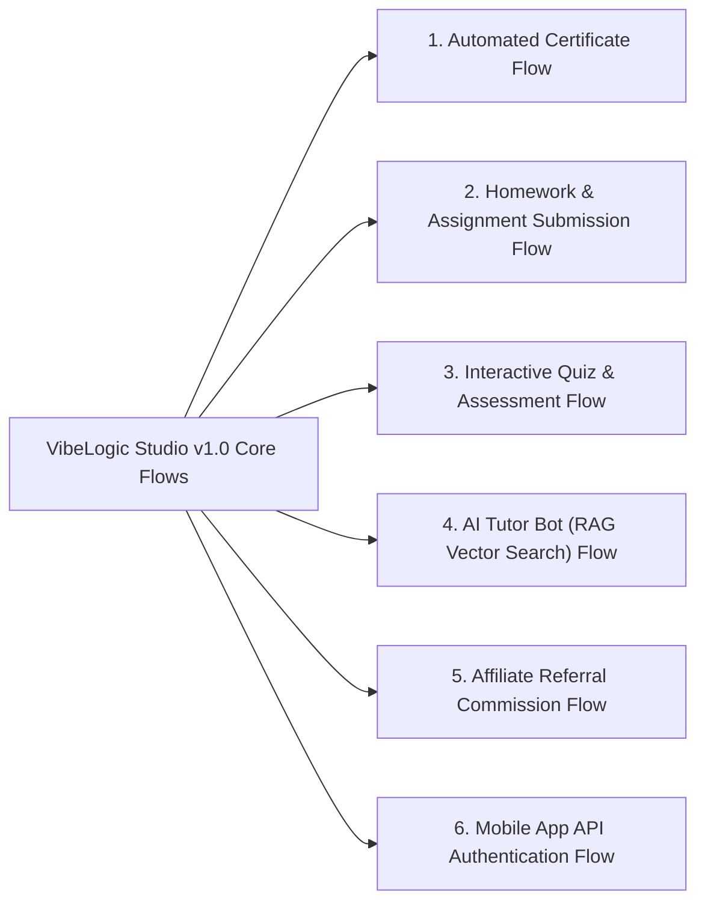

1. **Automated Certificate Flow:**
   - *Future Behavior:* When student progress reaches 100%, system renders custom PDF certificate via background worker and unlocks `"Download Certificate"` button in `/dashboard`.
2. **Assignment Submission Flow:**
   - *Future Behavior:* Students upload homework `.zip` or `.pdf` on lesson pages; instructors review and grade in `/admin/submissions`.
3. **Interactive Quiz Flow:**
   - *Future Behavior:* Multiple-choice assessment checkpoints required before progressing to subsequent course modules.
4. **AI Tutor Assistant Flow:**
   - *Future Behavior:* Floating AI classroom assistant answering technical course questions using vectorized syllabus embeddings.
5. **Affiliate Referral Flow:**
   - *Future Behavior:* Students generate custom referral links (`?ref=user_id`); successful peer enrollments credit wallet balance.

---

## 29. Summary for AI Agents & Developers

When implementing any page, component, or server action in VibeLogic Studio:
1. **Check Role Permissions First:** Ensure the route or action enforces the boundaries defined in **Section 23**.
2. **Handle Every Empty State:** Never render a blank screen; implement the exact empty state copy and CTAs defined in **Section 24**.
3. **Respect Scarcity & Concurrency:** All course enrollments must verify cohort seat capacity atomically as specified in **Section 7**.
4. **Fail-Open on Cache:** Never block a user if Upstash Redis is down; always fall back to Convex as specified in **Section 22**.
